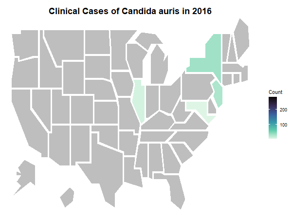
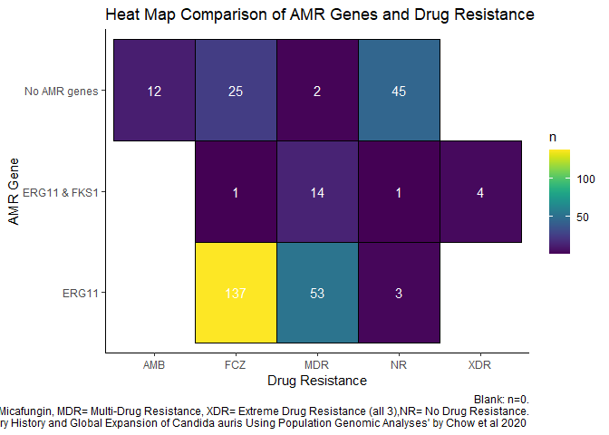
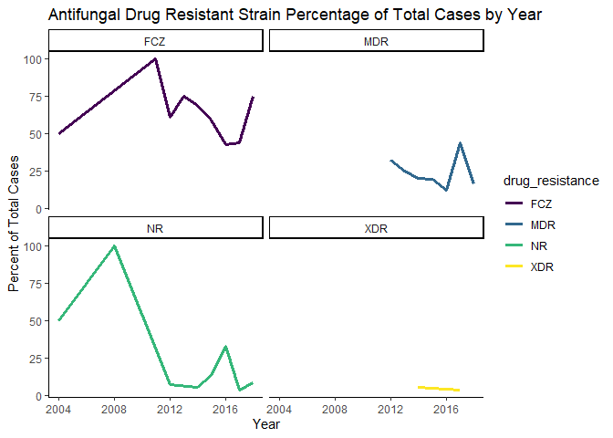
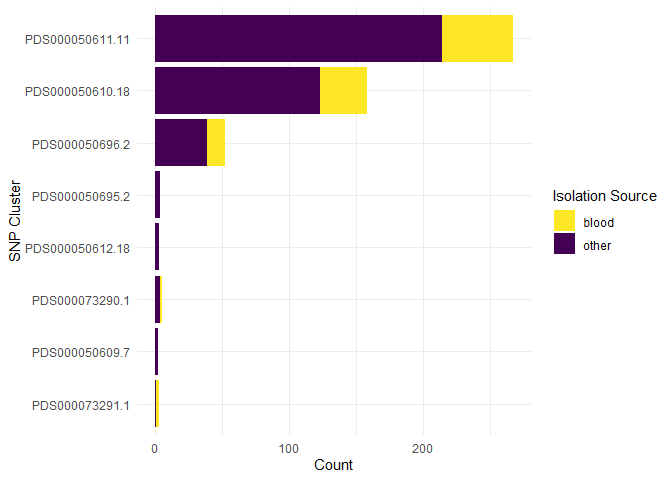
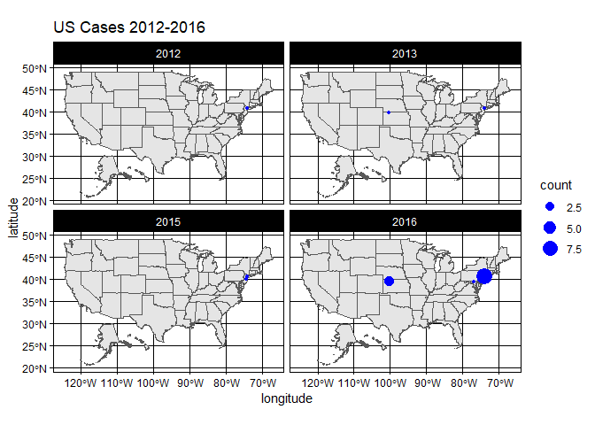
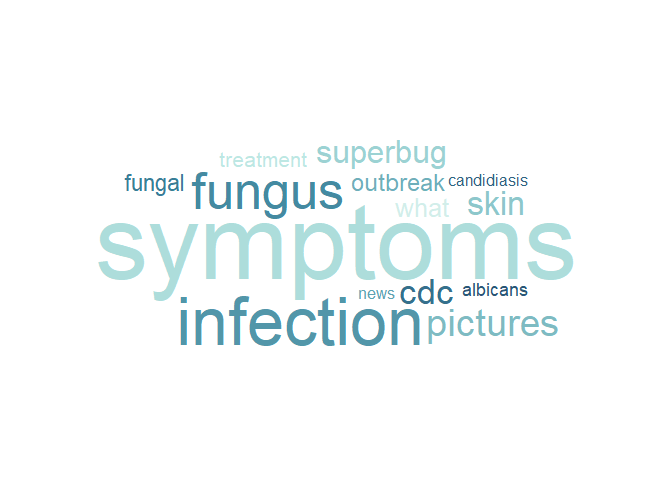
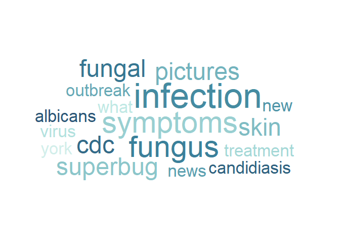
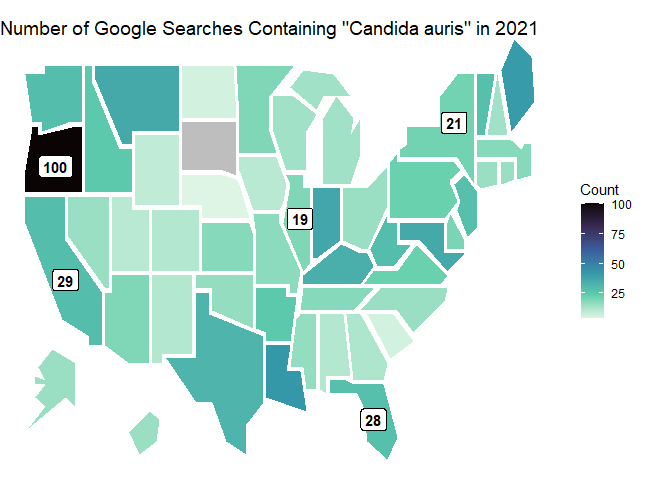
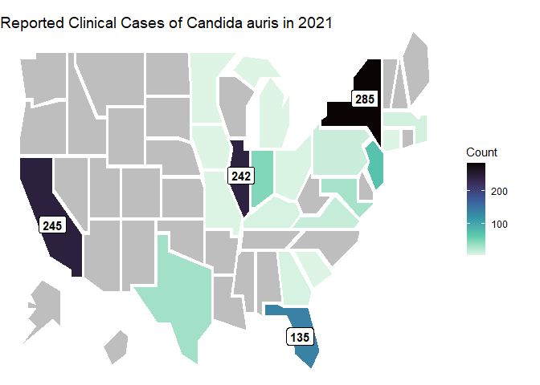

## Load Microreact Global data set


```r
microreact<- read_csv("../Data/microreact_isolates.csv")
```

```
## Rows: 305 Columns: 20
## -- Column specification --------------------------------------------------------
## Delimiter: ","
## chr (15): ID, CLADE, CLADE__colour, COUNTRY, COUNTRY__colour, FCZ, FCZ__colo...
## dbl  (5): Latitude, Longitude, year, month, day
## 
## i Use `spec()` to retrieve the full column specification for this data.
## i Specify the column types or set `show_col_types = FALSE` to quiet this message.
```

```r
microreact <- janitor::clean_names(microreact)
#View(microreact)
```


## Load the U.S. clinical cases data sets.
The reported clinical cases data sets for the years 2016 - 2021 contain the 
same variables but do not have the same column names. Therefore, before merging 
these data sets, we standardized the column names and removed missing values.

```r
## Load the reported clinical cases (rcc) data sets:
# Obtain file names.
rcc_files <- list.files(path = "../Data/us_clinical_cases", 
                        pattern = ".csv", 
                        full.names = TRUE)

# Store all data sets in a list.
rcc <- rcc_files %>% 
  lapply(read_csv)

# Rename the data sets by year.
rcc_names <- list.files(path = "../Data/us_clinical_cases", 
                        pattern = ".csv") %>% 
  strsplit(".csv") %>% 
  unlist()

names(rcc) <- rcc_names

# Check if the number of columns is the same in each data set.
# for (i in 1:(length(rcc) - 1)){
  # print(dim(rcc[[i]])[2] == dim(rcc[[i + 1]])[2])}
    # number of cols in 2019 daa does not match 2020 data
    # number of cols in 2020 does not match 2021 data

# check the columns in the 2020 data set.
# rcc$reported_cases_2020 %>% 
#   colnames()
    # Empty columns

# Remove empty columns in the 2020 data set.
rcc$reported_cases_2020 <- rcc$reported_cases_2020 %>% 
  select(1:4)

# Check that number of columns match in all data sets after removing the empty 
# columns in the 2020 data set.
# for (i in 1:(length(rcc) - 1)){
#  print(dim(rcc[[i]])[2] == dim(rcc[[i + 1]])[2])}
    # All data sets now have the same number of columns

# Check that the column names match across all data sets.
# for (i in 1:(length(rcc) - 1)){
#  print(colnames(rcc[[i]]) == colnames(rcc[[i + 1]]))}
  # The columns contain the same data types, but the names do not match
  # across all data sets.
```


```r
## Standardize the column names and variable types:
# Create a vector containing the new names.
rcc_col_names <- c("jurisdiction", "any_cases", "clinical_cases", "range")

# Assign the new names to all data sets.
rcc <- rcc %>% 
  lapply(setNames, rcc_col_names)

# Change the character column variable types to factor.
# for loop solution
for (i in 1:length(rcc)){
  rcc[[i]] <- rcc[[i]] %>% 
    mutate(across(where(is.character), factor))
}
# purr solution?


## Add a year column to all data sets:
# Obtain all years in the list of data sets.
rcc_years <- rcc_names %>% 
  str_remove("reported_cases_") %>% 
  as.integer()

# Add the year to all rows.
# for loop solution
# for (i in 1:length(rcc)){
#  rcc[[i]] <- rcc[[i]] %>% 
#    mutate(year = rcc_years[i])}

# purr solution
rcc <- rcc %>%
  map2(rcc_years, ~mutate(.x, year = .y))
```


```r
# Merge the data sets:
# Drop any rows with non-clinical case counts.
all_reported_cases <- rcc %>% 
  bind_rows() %>% 
  relocate(year) %>% 
  arrange(year) %>% 
  filter(!is.na(jurisdiction),
         clinical_cases != 0) %>% 
  select(-any_cases) 

# write_csv(all_reported_cases, "all_reported_cases.csv")
```


## Load the NCBI Isolates Browser data.

```r
# Load the NCBI isolates data and select the variables of interest:
# Load the data.
ncbi <- read_csv("../Data/ncbi_isolates.csv") %>% 
  clean_names() %>% 
  select(isolate, create_date, location, 
         isolation_source, isolation_type, snp_cluster)

# Select all rows associated with US clinical cases.
ncbi_clinical_isolates <- ncbi %>%
  filter(str_detect(location, "USA"),
         isolation_type == "clinical",) %>% 
  drop_na()

# Remove "USA: " and "USA:" from values in the location column 
# and rename as state.
ncbi_clinical_isolates <- ncbi_clinical_isolates %>% 
  mutate(location = str_replace(location, "USA: ", "")) %>% 
  mutate(location = str_replace(location, "USA:", "")) %>% 
  mutate(location = str_replace(location, "Houston", "Texas")) %>% 
  mutate(location = str_replace(location, "Chicago", "Illinois")) %>% 
  mutate(location = str_replace(location, "New jersey", "New Jersey")) %>% 
  filter(location != "USA") %>% 
  rename(state = location) %>% 
  mutate(state = factor(state)) 
  
# Change the values in the isolation source column to one of two categories: 
# blood and other.
ncbi_clinical_isolates <- ncbi_clinical_isolates %>% 
  mutate(isolation_source = 
           case_when(str_detect(isolation_source, "blood") ~ "blood",
                     TRUE ~ "other"))

# Change the remaining character columns to factor.
ncbi_clinical_isolates <- ncbi_clinical_isolates %>% 
  mutate(across(where(is.character), factor))

#write_csv(ncbi_clinical_isolates, "ncbi_clinical_isolates.csv")
```


## Create an animated map to show the clinical cases in the US since 2016.

```r
## Create an animated map for the reported clinical cases:
# Load the state boundary basemap.
states <- map_data("state.vbm") %>% 
  tibble() %>% 
  mutate(region = factor(region))

USplot <- ggplot() +
  geom_polygon(data = states, aes(x=long, y = lat, group = group)) 

# Join the reported clinical cases data to the state boundary map data.
#   rcc data has state abbreviations, not names
#   need to add a state name column to the rcc data
#     make a new data frame using built in state name data sets
state_key <- tibble(jurisdiction = state.abb, region = state.name)
all_reported_cases <- inner_join(all_reported_cases, 
                                 state_key, 
                                 by = "jurisdiction") %>% 
  mutate(region = factor(region))

# Join the reported clinical cases data to the state boundary map data.
statewide_cases <- inner_join(states, all_reported_cases, by = "region")

# Since some states had no cases, they will appear as empty polygons in a map
# Need to create an additional data frame containing the names of states
# without cases for each year so that we can fill in the empty polygons

# Create the not in operator.
`%!in%` <- Negate(`%in%`)

# Subset statewide reported cases by year.
for (i in 1:6) {
  assign(paste("statewide_cases", rcc_years[i], sep = "_"), 
         statewide_cases %>% 
           filter(year == rcc_years[i]))
}

statewide_cases_list <- list(statewide_cases_2016,
                             statewide_cases_2017,
                             statewide_cases_2018,
                             statewide_cases_2019,
                             statewide_cases_2020,
                             statewide_cases_2021)

# Use the statewide case count year subsets to extract states 
# with no cases for each year.
for (i in 1:6) {
  assign(paste("no_cases", rcc_years[i], sep = "_"), 
         state_key %>% 
           filter(region %!in% statewide_cases_list[[i]]$region) %>%  
           select(region) %>% 
           mutate(year = rcc_years[i]))
}

no_cases <- bind_rows(no_cases_2016,
                      no_cases_2017,
                      no_cases_2018,
                      no_cases_2019,
                      no_cases_2020,
                      no_cases_2021)

# Join the extracted states to the state map data to create the data frame
# containing all states with no cases for each year.
no_cases <- inner_join(states, no_cases, by = "region")

# Draw the geographical map.
fig <- ggplot() +
  geom_polygon(data = no_cases, 
               aes(x = long, y = lat, group = group), fill = "gray") +
  geom_polygon(data = statewide_cases, 
               aes(x = long, y = lat, group = group, fill = clinical_cases)) +
  labs(fill = "Count") +
  scale_fill_viridis_c(option = "mako", direction = -1) +
  theme_void()

# Animate the map and save as a gif.
fig_animated <- fig +
  transition_time(year) +
  ggtitle('Clinical Cases of Candida auris in {frame_time}') +
  theme(plot.title = element_text(hjust = 0.5, size = 18, face = "bold",
                                  margin = margin(t = 15, b = -15)),
        legend.box.margin = margin(10,10,10,10))

animate(fig_animated, nframes = 6, fps = 0.5, height = 450, width = 600)
```

<!-- -->

```r
#anim_save("us_clinical_cases_map.gif")
```

## View Microreact/ Chow et al data


```r
summary(microreact)
```

```
##       id               latitude         longitude          clade          
##  Length:305         Min.   :-28.817   Min.   :-118.76   Length:305        
##  Class :character   1st Qu.:  4.598   1st Qu.: -74.08   Class :character  
##  Mode  :character   Median : 10.980   Median : -71.64   Mode  :character  
##                     Mean   : 19.756   Mean   : -22.90                     
##                     3rd Qu.: 39.784   3rd Qu.:  38.43                     
##                     Max.   : 55.367   Max.   : 139.24                     
##                                                                           
##  clade_colour         country          country_colour          year     
##  Length:305         Length:305         Length:305         Min.   :2004  
##  Class :character   Class :character   Class :character   1st Qu.:2014  
##  Mode  :character   Mode  :character   Mode  :character   Median :2016  
##                                                           Mean   :2015  
##                                                           3rd Qu.:2016  
##                                                           Max.   :2018  
##                                                                         
##      month             day           fcz             fcz_colour       
##  Min.   : 1.000   Min.   : 1.0   Length:305         Length:305        
##  1st Qu.: 4.000   1st Qu.:11.0   Class :character   Class :character  
##  Median : 7.000   Median :15.0   Mode  :character   Mode  :character  
##  Mean   : 6.914   Mean   :15.7                                        
##  3rd Qu.: 9.000   3rd Qu.:21.0                                        
##  Max.   :28.000   Max.   :30.0                                        
##  NA's   :1                                                            
##      amb             amb_colour            mcf             mcf_colour       
##  Length:305         Length:305         Length:305         Length:305        
##  Class :character   Class :character   Class :character   Class :character  
##  Mode  :character   Mode  :character   Mode  :character   Mode  :character  
##                                                                             
##                                                                             
##                                                                             
##                                                                             
##     erg11           erg11_colour           fks1           fks1_colour       
##  Length:305         Length:305         Length:305         Length:305        
##  Class :character   Class :character   Class :character   Class :character  
##  Mode  :character   Mode  :character   Mode  :character   Mode  :character  
##                                                                             
##                                                                             
##                                                                             
## 
```

## Mutate new columns coding for genes and drug resistance


Mutating Data for showing resistance:

add column:


```r
#Here I am adding a column that codes for type of drug resistance

microreact_drug_resistance <- microreact %>% 
  mutate( drug_resistance = case_when(
    fcz=="Not_Resistant"& mcf=="Not_Resistant"& amb=="Not_Resistant" ~ "NR",
    fcz=="Resistant"& mcf=="Not_Resistant"& amb=="Not_Resistant" ~ "FCZ",
    fcz=="Not_Resistant" & mcf=="Resistant" & amb=="Not_Resistant" ~ "MCF",
    fcz=="Not_Resistant" & mcf=="Not_Resistant" & amb=="Resistant" ~ "AMB",
    
    fcz=="Resistant"& mcf=="Resistant"& amb=="Not_Resistant" ~ "MDR",
    fcz=="Resistant"& mcf=="Not_Resistant"& amb=="Resistant" ~ "MDR",
    fcz=="Not_Resistant"& mcf=="Resistant"& amb=="Resistant" ~ "MDR",
    
    fcz=="Resistant"& mcf=="Resistant"& amb=="Resistant" ~ "XDR"
  ))
```


Mutating data for showing ERG11 and FKS1 gene presence:


```r
#Here I am adding another column that codes for presence or absence of known drug resistance genes

microreact_drug_resistance <- microreact_drug_resistance %>% 
  mutate( amr_gene = case_when(
    erg11 != "WT" & fks1=="WT" ~ "ERG11",
    fks1 !="WT"& erg11 == "WT" ~ "FKS1",
    erg11 != "WT" & fks1 !="WT" ~ "ERG11 & FKS1",
    fks1 =="WT" & erg11 == "WT" ~ "No AMR genes"
))
```

## Microreact Heat Map relating drug resistance and AMR genes


```r
microreact_drug_resistance %>% 
  count(drug_resistance, amr_gene) %>% 
  filter(drug_resistance!="NA") %>% 
  ggplot(aes(drug_resistance, amr_gene, fill=n))+
  geom_tile(color="black")+
  geom_text(aes(label = n), color = "white", size = 4)+
  scale_fill_viridis()+
  theme_classic()+
  labs(title="Heat Map Comparison of AMR Genes and Drug Resistance",
       x="Drug Resistance",
       y="AMR Gene",
       caption="Blank: n=0.
       Drugs:AMB= Amphotericin B, FCZ= Fluconazole, MCF= Micafungin, MDR= Multi-Drug Resistance, XDR= Extreme Drug Resistance (all 3),NR= No Drug Resistance.
       Data from Tracing the Evolutionary History and Global Expansion of Candida auris Using Population Genomic Analyses' by Chow et al 2020 ")
```

<!-- -->

## AMR Resistance over time

Using global counts:


```r
microreact_drug_resistance %>% 
  filter(drug_resistance!="NA", drug_resistance!= "AMB") %>% 
 count(year, drug_resistance) %>% 
ggplot(aes(x=year, y=n, color=drug_resistance))+
  geom_line(size=1.25)+
  theme_classic()+
  scale_color_viridis_d()+
  labs(title="Antifungal Drug Resistant Strain Counts by Year",
       x="Year",
       y="Count (Global)")
```

<!-- -->

Using percentage of global cases:

finding total cases per year:

```r
micro_case_totals <- microreact_drug_resistance %>% 
  group_by(year) %>% 
  summarize(total_cases=n_distinct(id)) %>% 
  print()
```

```
## # A tibble: 10 x 2
##     year total_cases
##    <dbl>       <int>
##  1  2004           2
##  2  2008           3
##  3  2011           1
##  4  2012          28
##  5  2013          16
##  6  2014          35
##  7  2015          61
##  8  2016          92
##  9  2017          55
## 10  2018          12
```

Finding drug resistant cases per year:

```r
micro_drug_totals <- microreact_drug_resistance %>% 
  group_by(year, drug_resistance) %>% 
  summarize(total_drug=n_distinct(id)) %>% 
  print()
```

```
## `summarise()` has grouped output by 'year'. You can override using the
## `.groups` argument.
```

```
## # A tibble: 31 x 3
## # Groups:   year [10]
##     year drug_resistance total_drug
##    <dbl> <chr>                <int>
##  1  2004 FCZ                      1
##  2  2004 NR                       1
##  3  2008 NR                       3
##  4  2011 FCZ                      1
##  5  2012 FCZ                     17
##  6  2012 MDR                      9
##  7  2012 NR                       2
##  8  2013 FCZ                     12
##  9  2013 MDR                      4
## 10  2014 FCZ                     24
## # ... with 21 more rows
```


```r
#Ok I'm going to try to join these tables so there is a total case column for each year
join_drug_totals <- full_join(micro_drug_totals, micro_case_totals, by="year")
```


```r
#I need to mutate a new column now to show the percentage of drug resistant cases 
percent_drug_resistant <- join_drug_totals %>% 
  mutate(percent_of_total_cases=(total_drug/total_cases)*100)
```


```r
#Now a line graph of the percents!!
percent_drug_resistant %>% 
filter(drug_resistance!="NA", drug_resistance!= "AMB") %>% 
ggplot(aes(x=year, y=percent_of_total_cases, color=drug_resistance))+
  geom_line(size=1.25)+
  theme_classic()+
  scale_color_viridis_d()+
  labs(title="Antifungal Drug Resistant Strain Percentage of Total Cases by Year",
       x="Year",
       y="Percent of Total Cases")+
  facet_wrap(~drug_resistance, ncol=2)
```

<!-- -->


## Shiny App using case counts and filling with AMR genes or drug resistance


```r
#gotta use the kelp palette
colors <- paletteer::palettes_d_names
my_palette <- paletteer_d("calecopal::kelp2")
```

Adding the case counts data used for Shiny:


```r
case_counts <- microreact_drug_resistance %>% 
  count(country, year, amr_gene, drug_resistance) %>% 
  mutate(year=as.factor(year))
```


```r
ui <- dashboardPage( 
  dashboardHeader(title = "Case Counts per Year by Country"),
  dashboardSidebar(disable = T),
  dashboardBody(
  fluidRow(
  box(title = "Plot Options", width = 3,
      #select country dropdown
  selectInput("country",
              " Select Country",
              choices=unique(case_counts$country)), 
              selected = "United States"),
  #fill button to choose AMR gene or drug resistance
  radioButtons("x", 
                             "Select Fill Variable", 
                             choices=c("amr_gene", "drug_resistance"), selected = "drug_resistance"),
  
  ), # close the first box
  box(title = "Case Count", width = 7,
  plotOutput("plot", width = "400px", height = "300px")
  ) # close the second box
  ) # close the row
  ) # close the dashboard body
 # close the ui

server <- function(input, output, session) { 
  output$plot <- renderPlot({
    case_counts %>% 
      filter(country==input$country) %>%
  ggplot(aes_string(x = "year", y="n", fill=input$x)) +
      geom_col() + 
      theme_classic()+
       scale_fill_manual(values = my_palette)+
      labs(x="Year")
  })
  session$onSessionEnded(stopApp)
  }

shinyApp(ui, server)
```

`<div style="width: 100% ; height: 400px ; text-align: center; box-sizing: border-box; -moz-box-sizing: border-box; -webkit-box-sizing: border-box;" class="muted well">Shiny applications not supported in static R Markdown documents</div>`{=html}
##  US Map from Microreact data:
Focus on US

2004-2016 to give baseline for before CDC started tracking

Facet maps from 2012-2016


```r
microreact_coords_distinct <- microreact %>% 
  filter(year <=2016, country == "United States") %>% 
  select(latitude, longitude, year) %>% 
  arrange(year) %>% 
  distinct() %>% 
  mutate(count = 1)
#record the duplicate cases in same location so i can make a count coulomn to make = to the size of the point
microreact_coords_dup <- microreact %>% 
  filter(year <=2016, country == "United States") %>% 
  select(latitude, longitude, year) %>% 
  arrange(year) %>%
  get_dupes %>% 
  distinct() %>% 
  mutate(count=dupe_count)
```

```
## No variable names specified - using all columns.
```

```r
microreact_coords <- bind_rows(microreact_coords_distinct, 
                                                              microreact_coords_dup) %>% 
  arrange(year) %>% 
  print()
```

```
## # A tibble: 10 x 5
##    latitude longitude  year count dupe_count
##       <dbl>     <dbl> <dbl> <dbl>      <int>
##  1     40.7     -74.0  2012     1         NA
##  2     39.8    -100.   2013     1         NA
##  3     40.7     -74.0  2013     1         NA
##  4     40.1     -74.4  2015     1         NA
##  5     40.7     -74.0  2015     1         NA
##  6     39.5     -76.9  2016     1         NA
##  7     40.7     -74.0  2016     1         NA
##  8     39.8    -100.   2016     1         NA
##  9     39.8    -100.   2016     3          3
## 10     40.7     -74.0  2016     9          9
```

The Map:

```r
us_comp <- usa_sf()
ggplot() + 
  geom_sf(data = us_comp) + 
  geom_point(data=microreact_coords, aes(longitude, latitude, size=count), color="blue")+
  theme_linedraw()+
  facet_wrap(~year, ncol = 2)+
  labs(title = "US Cases 2012-2016")
```

```
## old-style crs object detected; please recreate object with a recent sf::st_crs()
## old-style crs object detected; please recreate object with a recent sf::st_crs()
```

<!-- -->

## Visualize the NCBI isolate data.

```r
## Calculate the proportion of isolates from blood for each SNP cluster as an
# indicator of bloodstream infection.
isolation_sources <- ncbi_clinical_isolates %>% 
  group_by(snp_cluster) %>% 
  count(isolation_source)

cluster_sources <- ncbi_clinical_isolates %>% 
  group_by(snp_cluster) %>% 
  tabyl(snp_cluster,isolation_source) %>% 
  arrange(desc(blood))

ggplot(data = isolation_sources) +
  geom_col(aes(x = fct_reorder(snp_cluster, n),
               y = n,
               fill = isolation_source)) +
  labs(x = "SNP Cluster",
       y = "Count",
       fill = "Isolation Source") +
  coord_flip() +
  scale_fill_viridis_d(direction = -1) +
  theme_minimal()
```

<!-- -->

```r
# SNP clusters associated with highest proportion of blood isolates are 
# PDS000050611.11, PDS000050610.18, and PDS000050696.2
```


```r
# Find states with snp_clusters with the highest prop of bloodstream infections.
blood_clusters <- ncbi_clinical_isolates %>% 
  filter(isolation_source == "blood",
         snp_cluster %in% as.vector(head(cluster_sources$snp_cluster, 3)))

blood_clusters %>% 
 group_by(state) %>% 
  summarize(n = n()) %>% 
  arrange(desc(n))
```

```
## # A tibble: 6 x 2
##   state          n
##   <fct>      <int>
## 1 Florida       31
## 2 New York      30
## 3 New Jersey    16
## 4 Illinois      13
## 5 Maryland       6
## 6 California     5
```

## Visualize the Google Trends data.

```r
# Create word clouds for the related queries:
# Load the related queries data.
related <- read_csv("../Data/google_search_trends/searchterm_candidaauris/relatedQueries.csv", 
                    skip = 3,
                    col_names = TRUE)
```

```
## Warning: One or more parsing issues, see `problems()` for details
```

```r
# Separate top queries from rising queries.
top_related <- related %>% 
  head(25)

rising_related <- related %>% 
  tail(26) %>%
  rename(query = TOP) %>% 
  slice(-1) %>% 
  mutate(query = str_remove(query, ",Breakout"))

## Obtain counts for words in top queries:
# Create Separate columns for counts and queries.
top_counts <- top_related %>% 
  separate(TOP, c("query", "count"), ",") %>% 
  head(-2) # remove candida and auris

# Use text mining to get total counts for each word.
# Create and preprocess a corpus for top queries.
top_corpus <- Corpus(VectorSource(top_counts$query)) %>% 
  tm_map(removeWords, c("is", "of", "candida", "auris"))
```

```
## Warning in tm_map.SimpleCorpus(., removeWords, c("is", "of", "candida", :
## transformation drops documents
```

```r
# Create a document term matrix from the corpus.
# Each document (query) is represented by a set of tokens (words) and their counts.
top_dtm <- TermDocumentMatrix(top_corpus) %>% 
  as.matrix()

# Get word frequencies from the dtm.
top_words <- rowSums(top_dtm) 
top_totals <- tibble(word = names(top_words), freq = top_words) 
# freq > 1 = duplicate words
# multiply freq by count for each word

# Combine word frequencies with query counts to get totals for each word.
top_totals <- top_totals %>% 
  mutate(count = c((100+14), 27, (25+8), 20, 19, 17, 17, 
                   16, 14, (12+10), 10, 9, 8, 8)) %>% 
  mutate(n = freq*count)

## Create the word cloud.
set.seed(1)
ggplot(data = top_totals) +
  geom_text_wordcloud(aes(label = word , size = n, color = word)) +
  scale_size_area(max_size = 28) +
  scale_color_manual(values = paletteer_c("grDevices::Teal", 14)) +
  theme_minimal()
```

<!-- -->


```r
## Obtain counts for words in rising queries:
# No count column, so word frequencies are the totals.
# Create and preprocess a corpus for rising queries.
rising_corpus <- Corpus(VectorSource(rising_related$query)) %>% 
  tm_map(removeWords, c("is", "of", "candida", "auris"))
```

```
## Warning in tm_map.SimpleCorpus(., removeWords, c("is", "of", "candida", :
## transformation drops documents
```

```r
# create a document term matrix from the corpus.
rising_dtm <- TermDocumentMatrix(rising_corpus) %>% 
  as.matrix()

# Get word frequencies from the dtm.
rising_words <- rowSums(rising_dtm) 
rising_totals <- tibble(word = names(rising_words), freq = rising_words) 

## create the word cloud
ggplot(data = rising_totals) +
  geom_text_wordcloud(aes(label = word, size = freq, color = word)) +
  scale_size_area(max_size = 18) +
  scale_color_manual(values = paletteer_c("grDevices::Teal", 17)) +
  theme_minimal()
```

<!-- -->

## Compare number of reported clinical cases and Google searches in 2021.

```r
## Create the 2021 reported clinical cases map:
# Extract center coordinates for each state from the state boundary map data:
center_coords <- state.vbm.center %>% 
  as.data.frame() %>% 
  tibble() %>% 
  rename(long = x,
         lat = y) %>% 
  mutate(region = unique(states$region)) %>% 
  relocate(region)

# Join 2021 statewide case counts with center coordinates
# to use as state labels:
# Select region and case count columns from the 2021 data frame.
# Join columns with the center coordinates.
# Join with state abbreviations for faster filtering.
coords_2021 <- statewide_cases_2021 %>% 
  group_by(region) %>% 
  count(clinical_cases) %>% 
  select(-n) %>% 
  left_join(center_coords, by = "region") %>% 
  left_join(state_key, by = "region") %>% 
  rename(abb = jurisdiction)

# Crete the 2021 reported cases map:
ggplot() +
  geom_polygon(data = no_cases %>% 
                 filter(year == 2021), 
               aes(x = long, y = lat, group = group), fill = "gray") +
  geom_polygon(data = statewide_cases_2021, 
               aes(x = long, y = lat, group = group, fill = clinical_cases)) +
  geom_label(data = coords_2021,
            aes(x = long, y = lat, label = clinical_cases),
            fontface = "bold") +
  labs(fill = "Count",
       title = "Reported Clinical Cases of Candida auris in 2021") +
  theme_void() +
  scale_fill_viridis_c(option = "mako", direction = -1) +
  theme(plot.title = element_text(size = 14,
                                  margin = margin(t = 15, b = -15)),
        legend.margin = margin(10, 30, 10, 10))
```

<!-- -->

```r
# No cases in Oregon but high freq of searches from google trends data
# voluntary reporting?
```


```r
## Create the 2021 Google searches map.
# Load the Google searches data.
searches_2021 <- read_csv("../Data/google_search_trends/searchterm_candidaauris/geoMap_2021.csv",
                          skip = 2,
                          col_names = TRUE) %>% 
  rename(region = Region,
         count = `Candida auris: (3/9/21 - 3/9/22)`)

# Add the abbreviation column for faster filtering.
searches_2021 <- inner_join(searches_2021, states, by = "region") %>% 
  inner_join(state_key, by = "region") %>% 
  rename(abb = jurisdiction) %>% 
  relocate(abb, .before = count)

# Relate the center coordinates to the number of searches in each state.
searches_2021_coords <- inner_join(searches_2021 %>% 
                                     select(region, abb, count),
                                   center_coords,
                                   by = "region")

# Create a vector containing the abbreviations of states of interest.
# Includes states with high number of reported cases or google searches.
states_of_interest <- c("CA", "IL", "NY", "FL", "OR")
soi_2021_coords <- searches_2021_coords %>% 
  filter(abb %in% states_of_interest)

ggplot(data = searches_2021) +
  geom_polygon(aes(x = long, y = lat, group = group, fill = count)) +
  geom_label(data = soi_2021_coords,
             aes(x = long, y = lat, label = count),
             fontface = "bold") +
  theme_void() +
  scale_fill_viridis_c(option = "mako", direction = -1, na.value = "gray") +
  labs(fill = "Count",
       title = 'Number of Google Searches Containing "Candida auris" in 2021') +
  theme(plot.title = element_text(size = 14,
                                  margin = margin(t = 15, b = -15)),
        legend.margin = margin(10, 30, 10, 10))
```

<!-- -->


```r
# Make a copy of the 2021 reported cases map with only the states of interest
# labeled.
ggplot() +
  geom_polygon(data = no_cases %>% 
                 filter(year == 2021), 
               aes(x = long, y = lat, group = group), fill = "gray") +
  geom_polygon(data = statewide_cases_2021, 
               aes(x = long, y = lat, group = group, fill = clinical_cases)) +
  geom_label(data = coords_2021 %>% 
               filter(abb %in% states_of_interest),
            aes(x = long, y = lat, label = clinical_cases),
            fontface = "bold") +
  theme_void() +
  labs(fill = "Count",
       title = "Reported Clinical Cases of Candida auris in 2021") +
  scale_fill_viridis_c(option = "mako", direction = -1) +
  theme(plot.title = element_text(size = 14,
                                  margin = margin(t = 15, b = -15)),
        legend.margin = margin(10, 30, 10, 10))
```

<!-- -->

